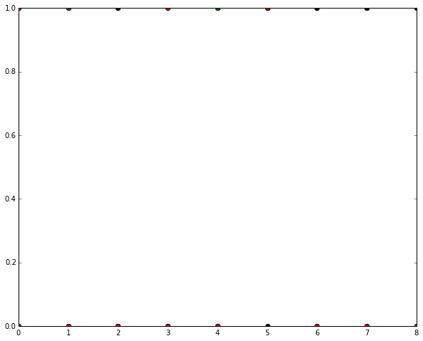
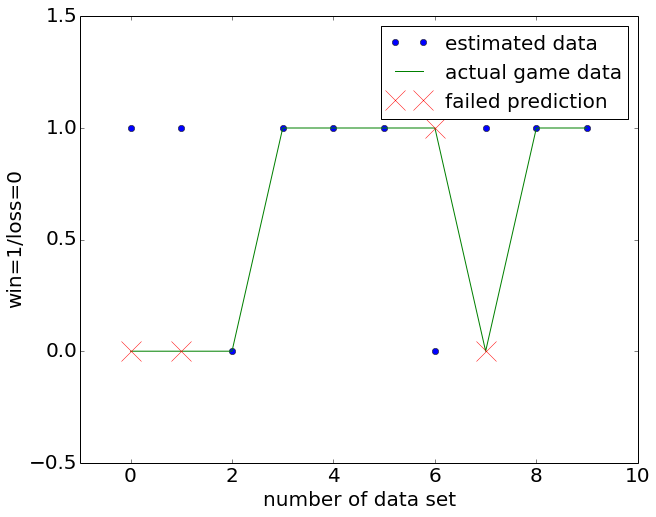

```python
%load_ext autoreload
%autoreload 2
%matplotlib inline
import matplotlib.pyplot as plt
import numpy as np
```
data mining of NHL data - author: s. konzett-stoffl\nmethods devised after the book "Data Mining and Analysis" by Zakin and Meira" using nhlscrapi, fetched at http://pythonhosted.org/nhlscrapi\nand the analysis library scikit learn - the NHL scraper is nhlscrapi, written by Rob Howley - it is distributed under the Apache license - used version in 0.4.3.This notebook tries to predict NHL games outcomes and to this end uses a python class I've written to interface the NHL data I mined in the minerNHL notebook and feeds a pybrain neural network to predict games outcomes. The outcome is plotted using matplotlib.The data we investigate is only a subset of the whole, containing the local derbys between the New York Islanders and the New York Rangers. We split the data into a training part and a target part to test if:
1.) it's possible at all to make predictions which are worth more than the throwing of a dice.
2.) it's possible with the limited amount of data we have on our purpose:
        - the number of derbys is limited even in multiple seasons
        - the number of parameters we feed into the network are an atomic
          subset of the wholeThe idea in this investigation is to feed the network with data generated from the input data, describing the performance of both teams against each other and against other opponents. As I do not expect the outcome to depend only on the previous matchup and do not think that the outcome to be a completely Markovian process either, I tried to generate some kind of history of both teams to feed into the neural network. The following input parameters are used as input for the network:

    1.) first team home matchup score, until current matchup
    2.) second team home matchup score
    3.) first teams performance over last N games
    4.) second teams performance over last N games
    5.) days off the first team had before matchup
    6.) days off the second team had before matchup
    
The last two criteria were added after noting the (slight) difference it makes if a team has days off before playing or not. (see the R notebook "winOrLooseNHL")First we read the NHL datasets using the prepareData class.

```python
import sys
sys.path.append('../python')
from setupNhlDataC import prepareDataC
pDC=prepareDataC("all",readUsingTK=False)
pDC.prepareData()
```

    data preparation finished.
    we have found, read and processed the following datasets:
    following seasons for delta values: 
    [2010, 2011, 2012, 2013, 2014, 2015, 2016]
    following seasons for summed values: 
    [2010, 2011, 2012, 2013, 2014, 2015, 2016]


Now as the data is stored in the pDC instance of the data preparation class, we can initialize the Neural Network class. The data is transferred by the AnalysisC class, which interconnects the data analysis classes.


```python
from NHLstat import AnalysisC, NeuralNetworkAnalysisC
aNC=AnalysisC(pDC)
```

    AnalysisC class instance successfully initialized!

Now, let's create an instance of the neural network class, which provides methods to prepare data, to run the network and to postprocess the data.

```python
nNC=NeuralNetworkAnalysisC(aNC)
```
The method AnalyzeMatchup in the NeuralNetworkAnalysisC class creates and runs the neural network. Here we step through the process step by step.First we choose the dataset of differences to be the dataset from which to extract the input.

```python
nNC.SetCurrentlyAnalyzedDataSetDict(0)
```
Now that we've set the data set to be the one with differences of game stats we prepare the data as described in the 6 categories above. Here we specify also the two teams to look at, it's my favorite team, the Islanders and the New York Rangers.

```python
nNC.SetupNNDataMatchup("NYI","NYR")
```

    Finished the preparation of input data for Neural Network.
    The input dataset contains 34 samples 
    We have 34 input datasets and one output dataset

In the next step we divide the input data into a learning set and a target set. The input to the class method is a number between 0.5 and 0.9, giving the part of the data to be given the label of training data.

```python
nNC.PrepareNNInputData(0.3)
```

    Training data prepared: 
    Number of training patterns: 24
    Number of testing datasets: 10
    Input and output dimensions: 61
    First sample:
    Input data: [  0.5          0.33333333   0.           1.          10.           2.        ]
    Output data: [ 1.]

In the next step we set parameters of the neural net architecture. As we do not know in advance how the net should look like, we try different configurations and test a posteriori which fits best. The first parameter we can choose is the number neurons in the hidden layer as a multiple of the number of neurons in the input layer. Our approach is entirely built upon a feed forward neuronal network, not using any backpropagatin features pybrain would give us. The second parameter is actually a set of two, setting the minimal and maximal number of hidden layers in the network. In the following the code tries each of the configurations in between and trains the network for the input data. As a starting point we vary the number of hidden layers from 1 to 3 and start with 2 times the neurons in the hidden layers compared to the input layer, which has 6 neurons in our case, one for each input parameter.

```python
nNC.SetNoHiddenNeuronLayersMinMax(1,3)
nNC.SetHiddenNeuronsAsMultipleOfInputNeurons(3)
```
Using these parameters we are ready to build the feed forward neural network. We just read the parameter that we've set again. The purpose of setting the parameter in the first place becomes obvious later on. We set up the network with one hidden layer for a start.

```python
noHiddenNeuronsPerLayer=nNC.GetHiddenNeuronsAsMultipleOfInputNeurons()
numberOfHiddenLayers=1
nNC.SetupNeuralNetwork(numberOfHiddenLayers,noHiddenNeuronsPerLayer)
```

    Finished setup of a feed forward neural network with 1 hidden layers and 18 neurons in the hidden layers.

In the next step we execute the network for the first set of parameters.

```python
[nNC._outNNEstimateList,nNC._outNNActual,nNC._errNNPrct]=nNC.RunNeuralNetwork()
```

    The neuronal network predicted 70.0 % of the test data correctly

The plot below shows as blue dots the estimated results and as green line the connection between the input results of the target test data.

```python
plt.figure(num=None, figsize=(10, 8))
print "The best dataset so far predicted ",nNC._errNNPrct[0],"% of the data right!"
errorList=[]
for (estimate,actual) in zip(nNC._outNNEstimateList,nNC._outNNActual):
    if estimate==actual:
        errorList.append(np.nan)
    else:
        errorList.append(actual)
plt.plot(nNC._outNNEstimateList,'o', label='estimated data')
plt.plot(nNC._outNNActual, label='actual game data')
plt.plot(errorList,"x",markersize=20, label='failed prediction')
plt.xlabel("number of data set")
plt.ylabel("win=1/loss=0")
plt.legend(fontsize=20)
axes = plt.gca()
axes.set_ylim([-0.4,1.9])
axes.set_xlim([-1,len(nNC._outNNActual)+1]);
for item in ([axes.title, axes.xaxis.label, axes.yaxis.label] +
             axes.get_xticklabels() + axes.get_yticklabels()):
    item.set_fontsize(20)
```

    The best dataset so far predicted  [ 20.] % of the data right!


    ---------------------------------------------------------------------------

    ValueError                                Traceback (most recent call last)

    <ipython-input-182-ec70500e0c0b> in <module>()
          8         errorList.append(actual)
          9 plt.plot(nNC._outNNEstimateList,'o', label='estimated data')
    ---> 10 plt.plot(nNC._outNNActual, label='actual game data')
         11 plt.plot(errorList,"x",markersize=20, label='failed prediction')
         12 plt.xlabel("number of data set")


    /usr/lib/pymodules/python2.7/matplotlib/pyplot.pyc in plot(*args, **kwargs)
       2985         ax.hold(hold)
       2986     try:
    -> 2987         ret = ax.plot(*args, **kwargs)
       2988         draw_if_interactive()
       2989     finally:


    /usr/lib/pymodules/python2.7/matplotlib/axes.pyc in plot(self, *args, **kwargs)
       4135         lines = []
       4136 
    -> 4137         for line in self._get_lines(*args, **kwargs):
       4138             self.add_line(line)
       4139             lines.append(line)


    /usr/lib/pymodules/python2.7/matplotlib/axes.pyc in _grab_next_args(self, *args, **kwargs)
        315                 return
        316             if len(remaining) <= 3:
    --> 317                 for seg in self._plot_args(remaining, kwargs):
        318                     yield seg
        319                 return


    /usr/lib/pymodules/python2.7/matplotlib/axes.pyc in _plot_args(self, tup, kwargs)
        293             x = np.arange(y.shape[0], dtype=float)
        294 
    --> 295         x, y = self._xy_from_xy(x, y)
        296 
        297         if self.command == 'plot':


    /usr/lib/pymodules/python2.7/matplotlib/axes.pyc in _xy_from_xy(self, x, y)
        237             raise ValueError("x and y must have same first dimension")
        238         if x.ndim > 2 or y.ndim > 2:
    --> 239             raise ValueError("x and y can be no greater than 2-D")
        240 
        241         if x.ndim == 1:


    ValueError: x and y can be no greater than 2-D




The first result is not more promising than the toss of a dice, but may become better with increasing complexity of the neural network structure. To this end we compute the neural network structure for multiple neural networks and compare the outcomes to see if we can beat the dice.

```python
nNC._outNNEstimateList=[]
nNC._outNNActual=[]
nNC._errNNPrct=[]
for noNeuronsInHiddenLayer in range(1,nNC._NONEURONSHIDDENLAYER_MULTIPLE_OF_INPUT_NEURONS+1):
    for nohiddenLayers in range(nNC._NOHIDDENLAYERSMIN,nNC._NOHIDDENLAYERSMAX+1):
    #setup of the new neural network
        nNC.SetupNeuralNetwork(nohiddenLayers,noNeuronsInHiddenLayer)
        [tmp1,tmp2,tmp3]=nNC.RunNeuralNetwork()
        nNC._outNNEstimateList.append(tmp1)
        nNC._outNNActual.append(tmp2)
        nNC._errNNPrct.append(tmp3)
        print "****************"
```

    Finished setup of a feed forward neural network with 1 hidden layers and 6 neurons in the hidden layers.
    The neuronal network predicted 20.0 % of the test data correctly
    ****************
    Finished setup of a feed forward neural network with 2 hidden layers and 6 neurons in the hidden layers.
    The neuronal network predicted 40.0 % of the test data correctly
    ****************
    Finished setup of a feed forward neural network with 3 hidden layers and 6 neurons in the hidden layers.
    The neuronal network predicted 20.0 % of the test data correctly
    ****************
    Finished setup of a feed forward neural network with 1 hidden layers and 12 neurons in the hidden layers.
    The neuronal network predicted 10.0 % of the test data correctly
    ****************
    Finished setup of a feed forward neural network with 2 hidden layers and 12 neurons in the hidden layers.
    The neuronal network predicted 50.0 % of the test data correctly
    ****************
    Finished setup of a feed forward neural network with 3 hidden layers and 12 neurons in the hidden layers.
    The neuronal network predicted 60.0 % of the test data correctly
    ****************
    Finished setup of a feed forward neural network with 1 hidden layers and 18 neurons in the hidden layers.
    The neuronal network predicted 30.0 % of the test data correctly
    ****************
    Finished setup of a feed forward neural network with 2 hidden layers and 18 neurons in the hidden layers.
    The neuronal network predicted 30.0 % of the test data correctly
    ****************
    Finished setup of a feed forward neural network with 3 hidden layers and 18 neurons in the hidden layers.
    The neuronal network predicted 60.0 % of the test data correctly
    ****************

Now plot the most promising of the neural network results.

```python
plt.figure(num=None, figsize=(10, 8))
mIndex=nNC._errNNPrct.index(max(nNC._errNNPrct))
print "The best dataset so far predicted ",nNC._errNNPrct[mIndex][0],"% of the data right!"
errorList=[]
for (estimate,actual) in zip(nNC._outNNEstimateList[mIndex],nNC._outNNActual[mIndex]):
    if estimate==actual:
        errorList.append(np.nan)
    else:
        errorList.append(actual)
plt.plot(nNC._outNNEstimateList[mIndex],'o', label='estimated data')
plt.plot(nNC._outNNActual[mIndex], label='actual game data')
plt.plot(errorList,"x",markersize=20, label='failed prediction')
plt.xlabel("number of data set")
plt.ylabel("win=1/loss=0")
plt.legend(fontsize=20)
axes = plt.gca()
axes.set_ylim([-0.4,1.5])
axes.set_xlim([-1,len(nNC._outNNActual)+1]);
for item in ([axes.title, axes.xaxis.label, axes.yaxis.label] +
             axes.get_xticklabels() + axes.get_yticklabels()):
    item.set_fontsize(20)
```

    The best dataset so far predicted  60.0 % of the data right!




Finally we got results which are slightly better than 50/50, but suspicion is still in order as the number of datasets to train the neural network is inherently limited. We can not push to far behind in the history of the matchups of two teams, first as the data is not available, second, as the teams consistency varies strongly over time, making a look at the history only of limit help in predicting the future.

```python

```
